# PCA robust to close relatives in PCAone: the `--robust` methods

*relatePCA working notes. Markdown version of [pcaone_robust_methods.pdf](pcaone_robust_methods.pdf); figures in [methods/](methods/).*

## 1 Overview

Close relatives (2nd degree and closer) distort PCA. Their shared genome adds covariance that has nothing to do with ancestry.

- **Small samples** (tens to a few hundred individuals): a single family can pull an ancestry axis off course, and the PCA loses one of the top $K-1$ axes.

- **Large samples:** the top axes survive, but relatives are misplaced, and the PCs just beyond the ancestry axes become “family axes”.

The `--robust` option of PCAone computes PCs in which close relatives keep their place in the sample but do not shape the axes. Every individual is analysed in-sample: nothing is projected.

| mode           | idea                                                    | assumes                         | role                             |
|:---------------|:--------------------------------------------------------|:--------------------------------|:---------------------------------|
| `aarobust-kin` | robust PCA (PCP) of the GRM, kinship threshold          | nothing on HWE; no $K$          | with `--impute-diag`, $N\le1000$ |
| `detect-white` | detect pairs on the CS matrix, then whitening           | rank from the data, $\le k+1$   | alternative (CS scale)           |
| `cswhite`      | Chen & Storey whitening with KING kinship               | HWE within individuals          | alternative                      |
| `frkin`        | fixed rank + kinship threshold on the CS matrix         | rank $k+1$                      | alternative                      |
| `dwg`          | `detect-white` on the GRM scale, admixture-aware screen | no HWE; $k$ only an upper bound | **default**                      |

**Table 1.** The modes. `--robust` alone means `auto`: `dwg` at every $N$ (operator engine in-core; dense engine out-of-core up to $N=5000$). With `--impute-diag`, `auto` uses `aarobust-kin` ($N\le1000$, `--robust-small-max`). The switch `--impute-diag` imputes the GRM diagonal; it works with standard PCA and with `aarobust-kin` (Section 5.6). The diagonal is always free in `dwg` and `detect-white`.

All four modes share three ideas:

1.  **Separate the matrix into structure and relatives.** The individual-by-individual matrix is split into a structure part and a sparse part that holds the related pairs. The PCs come from the structure part only, or from a matrix in which the related pairs are whitened away.

2.  **A kinship threshold decides what is “related”.** A pair enters the sparse part only if its structure-adjusted kinship exceeds $\tau=2^{-3.5}\approx0.088$, which lies between 2nd degree (0.125) and 3rd degree (0.0625). There is no tuning constant such as the $\lambda$ of standard robust PCA.

3.  **Only screened pairs can be related.** A pair may enter the sparse part only if its KING-robust kinship exceeds 0.04 (`--king-screen`). KING-robust corrects for differences in heterozygosity between populations, so for two individuals from the same unadmixed population it estimates kinship without structure bias, and unrelated members of a population are not declared related. It is not structure-free in general: across populations and for admixed individuals it is biased, downwards for relatives of different ancestry (a YRI grandparent and a $\tfrac14$-YRI grandchild: $-0.01$ instead of 0.125) and upwards for admixed individuals of similar ancestry. The screen also stops the early, low-rank steps of the fit from taking same-population pairs for relatives. `dwg` (Section 5.3) adds an admixture-aware screen for the relatives KING misses.

Figure 1 shows the effect on a real example used throughout this document:

- admixTjeck2 genotypes (1000 Genomes CEU, CHB, MXL, YRI), 10 unrelated individuals per population and 54k SNPs;

- 8 relatives made by copying alleles from real individuals: an MZ twin (YRI), a child (CEU), two full sibs (CHB), two half-sibs (MXL) and two individuals in an avuncular relationship (CEU).

Standard PCA loses the third axis (min $R^2=0.013$ against an independent reference truth). All four robust modes recover it ($R^2\ge0.997$; `aarobust-kin` shown with `--impute-diag`).

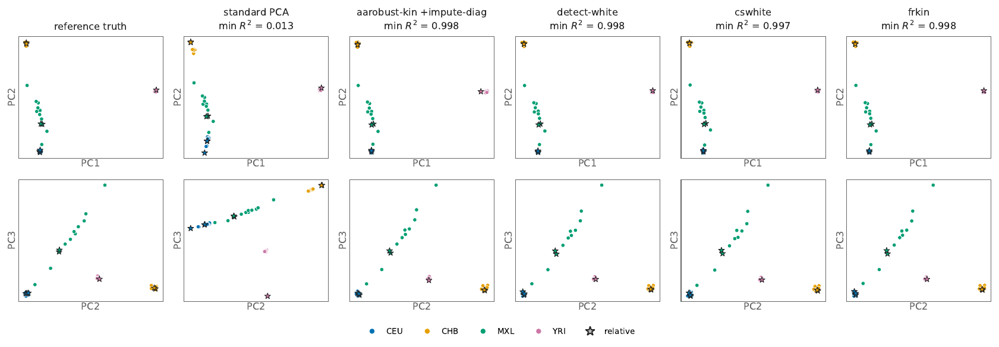

**Figure 1.** The example ($N=48$, 4 populations, 8 relatives as stars). Top row: PC1 vs PC2; bottom row: PC2 vs PC3. The reference truth is a PCA of the 326 admixTjeck2 individuals not in the sample, onto which the sample is projected. Each method’s PCs are mapped onto the truth by least squares on the unrelated individuals, and min $R^2$ is the worst of the three axes.

### How the methods are scored: the reference truth

To call a PCA right or wrong we need the PCs that the sample *should* have. A PCA of the sample’s own unrelated individuals cannot serve: at a few individuals per population it is itself wrong (Section 3), and using it would reward methods for reproducing its artefact. We therefore use an independent reference truth.

1.  **Reference panel.** Everyone in admixTjeck2 who is not in the sample: not among its unrelated individuals and not used as a parent or donor for its relatives. That is 326 of the 374 individuals in the example, about 80 per population.

2.  **PCA of the panel.** The genotypes are standardised with the panel’s allele frequencies, and the top $K-1$ axes are kept. With about 80 per population these axes are stable.

3.  **Projection.** Every sample individual is projected onto these axes with the panel’s frequencies and loadings. Relatives are projected with their realised genotypes, so their true position is where their ancestry puts them. Each axis is scaled to unit length so the axes count equally.

A method’s PCs are compared with this truth by regressing each true axis on the method’s $K-1$ PCs over the unrelated individuals, so rotation, sign and scale are free.

- **min $R^2$** is the worst of the $K-1$ axes. A run *fails* when min $R^2<0.95$, i.e. one true axis cannot be reconstructed from the method’s PCs (Figure 6).

- **The relatives’ error** is the distance between where the same regression places the relatives and their projected true position, relative to the spread of the sample.

The truth is itself an estimate: projection shrinks coordinates slightly, and each projected position carries SNP noise. Both effects are small with 54k SNPs and about 80 reference individuals per population. The simulations (large $N$) use the same construction with a separate panel of 3000 simulated unrelated individuals.

## 2 Three sample-size regimes

The right strategy depends on $N$. What limits each regime is different:

- **small $N$**: the statistics. The GRM diagonal is unreliable, and a single family can capture an ancestry axis;

- **large $N$**: the cost of the PCA itself, which must not form an $N\times N$ matrix;

- **very large $N$**: finding the relatives, because comparing all $N^2/2$ pairs becomes the most expensive step.

`--robust` (`auto`) picks the regime from $N$ (Table 2). Figures 2–4 show the pipeline of each. All three end with the same step: the final relatedness of the detected pairs, estimated from the final PCs (Section 6).

| regime          | $N$           | mode                                | finding the relatives                                                                        | engine                                   |
|:----------------|:--------------|:------------------------------------|:---------------------------------------------------------------------------------------------|:-----------------------------------------|
| small and large | $\le20{,}000$ | `dwg`                               | KING over all pairs, then evalAdmix + $k_0$                                                  | operator (dense out-of-core, $N\le5000$) |
|                 | $\le1000$     | `aarobust-kin` with `--impute-diag` | KING over all pairs (dense)                                                                  | dense                                    |
| very large      | $>20{,}000$   | `dwg`                               | count sketch + nearest neighbours, KING on the candidates; residual-sketch evalAdmix + $k_0$ | operator                                 |

**Table 2.** The regimes and their defaults. The limits are options: `--robust-dense-max` (5000), `--robust-small-max` (1000, `--impute-diag` only) and `--king-sketch-min` (20,000). `--kinship` replaces the search for the relatives in every regime.

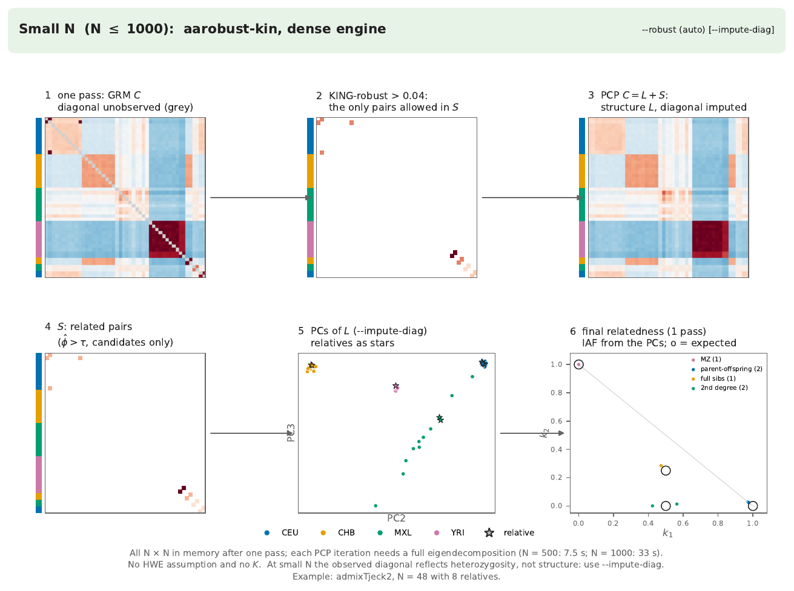

**Figure 2.** **Small $N$, `aarobust-kin`** (`--robust` `--impute-diag`; the default `dwg` is shown in Figure 9). One pass gives the GRM and the KING counts. PCP splits the GRM into structure $L$ and related pairs $S$, with the diagonal unobserved and only KING-screened pairs allowed into $S$. The PCs are those of $L$ (`--impute-diag`). A last pass estimates the final relatedness from the PCs. On the example the four relationship types fall on their expected $(k_1,k_2)$ (open circles; $k_0=1-k_1-k_2$ is the distance below the diagonal).

##### Small and large $N$

(`dwg`). The default at every $N$ is `dwg` (Section 5.3): `detect-white` on the GRM scale, with the diagonal free, kinship scaled by the fitted noise (no HWE), family axes that do not raise the rank (so $k$ is only an upper bound), and an admixture-aware screen for relatives KING misses. It needs only the top $r$ eigenvectors per step, so it runs in the operator engine without any $N\times N$ matrix: 1.1 s at $N=1000$, 4.7 s at $N=5000$ and 26.5 s at $N=20{,}000$ in-core. `aarobust-kin` (Figure 2) remains available with `--robust` `--impute-diag` or `--robust` `aarobust-kin`. It holds everything as $N\times N$ matrices after a single pass. The GRM diagonal is treated as unobserved, because at small $N$ it mostly reflects heterozygosity, which creates a spurious axis (Section 3). The method needs neither HWE nor $K$. Each PCP iteration needs a full eigendecomposition, which limits it to about $N=1000$ (33 s).

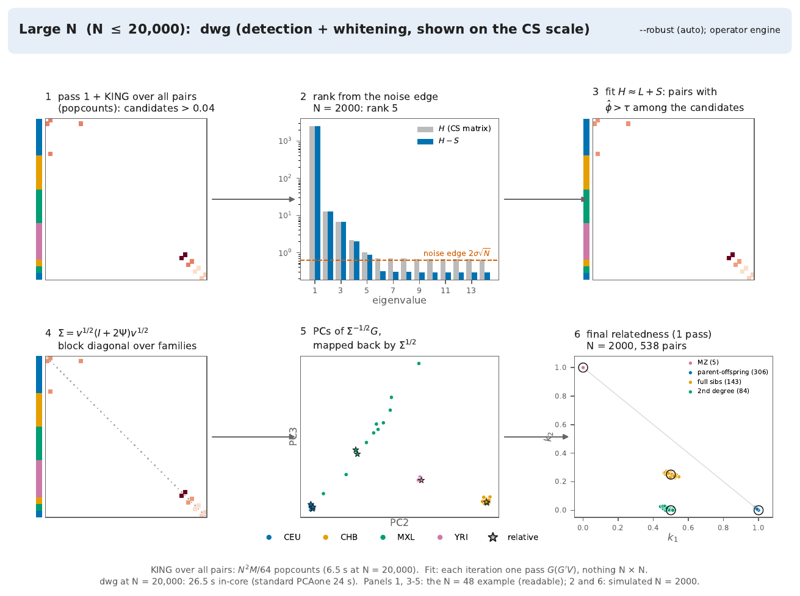

**Figure 3.** **Large $N$** (the detection and whitening steps, shown on the CS scale; `dwg` runs the same steps on the GRM scale). KING over all pairs (bit-packed genotypes and popcounts) gives the candidate pairs. The detection fit chooses the rank from the noise edge. In the CS spectrum of the simulated $N=2000$ data, the family eigenvalues lie just above the edge in $H$ and fall below it once the related pairs are removed ($H-S$), leaving rank 5 (four ancestry axes plus the mean). Whitening with the family covariance $\Sigma$ then gives the PCs. The final relatedness of the 538 detected pairs is on the right. The matrix panels use the $N=48$ example for readability.

##### Large $N$

($N\le20{,}000$; `dwg`, operator engine). Relatives no longer move the top ancestry axes, but they misplace themselves and create family axes just beyond them (Section 9). The operator engine forms no $N\times N$ matrix: each iteration is one pass over the genotypes, with the GRM-scale weights applied to the small product $G'V$. KING over all pairs uses popcounts of bit-packed genotypes (6.5 s at $N=20{,}000$); the exact GRM-scale entries of the candidate pairs come from one weighted pass.

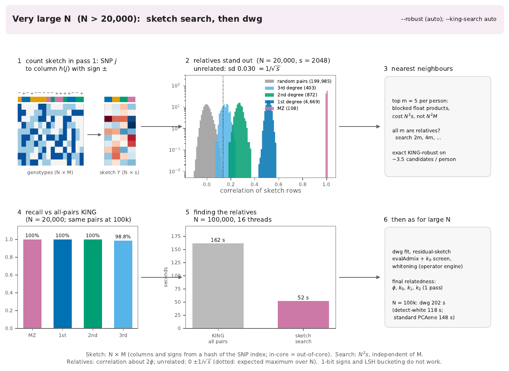

**Figure 4.** **Very large $N$.** The search for relatives replaces KING over all pairs. A count sketch of the standardised genotypes is built in the first pass. In it, relatives have a correlation of about $2\phi$ and unrelated pairs about $0\pm1/\sqrt{s}$: the histogram shows all 6052 true pairs of the simulated $N=20{,}000$ data against 200,000 random pairs. Each person’s 5 nearest neighbours are checked with exact KING. This finds every MZ, 1st- and 2nd-degree pair, at a third of the time of KING over all pairs at $N=100{,}000$. The rest of the pipeline is that of large $N$ (`dwg`).

##### Very large $N$

($N>20{,}000$; `dwg` with the sketch search). KING over all pairs costs $N^2M/64$ popcounts. At $N=100{,}000$ it takes longer than the whole PCA. It is replaced by a nearest-neighbour search in a sketch (Section 7.1), which finds exactly the same related pairs. Its cost is $N^2s$ with $s=2048$, independent of the number of SNPs. The same sketch, with the structure axes projected out, gives the candidates of the evalAdmix screen (Section 5.3). At $N=100{,}000$, `dwg` takes 226 s in-core (`detect-white` 118 s, standard PCAone 148 s): the residual-sketch neighbour search of the screen costs about 50 s, plus one refit when first cousins pass the screen.

## 3 The small-$N$ problem: the diagonal and the relatives

With few individuals per population, PCA has two separate problems. Figure 5 shows both on the same 20 unrelated admixTjeck2 individuals (5 per population), first alone and then with two MZ twins added.

1.  **The GRM diagonal, even without relatives.** The diagonal $C_{ii}$ is the sum of a structure part and a noise part. At $n=5$ the noise part dominates (about 0.9–1.2, against 0.05–0.25 for structure), and it differs between populations: it is largest for YRI, the most heterozygous. This uneven diagonal acts like an extra population indicator, and standard PCA spends an axis on it. In the top row, PC3 spreads the YRI individuals instead of separating MXL (min $R^2=0.057$). Imputing the diagonal from the off-diagonal entries (`--impute-diag`) removes the problem (0.999).

2.  **The relatives.** Adding two MZ twins changes the PCs again (standard PCA: 0.228).

    - `aarobust-kin` with the observed diagonal kept removes the twins’ effect: its PCs are those of the unrelated sample. It is therefore left with problem 1 (0.038).

    - Only the combination of relatedness correction and diagonal imputation recovers the true axes (0.999).

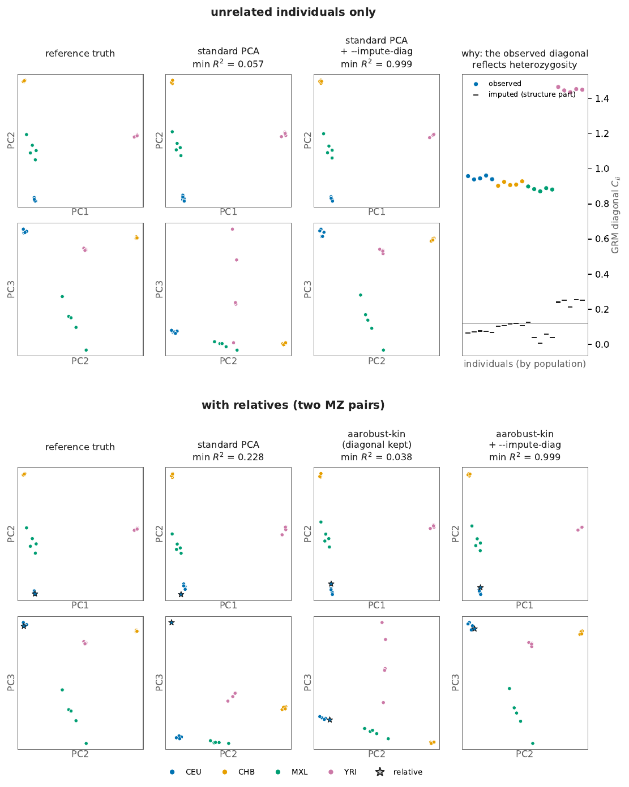

**Figure 5.** The small-$N$ problem at $n=5$ per population (admixTjeck2, 54k SNPs). *Top:* 20 unrelated individuals; the right panel shows each individual’s observed GRM diagonal and its imputed structure part. *Bottom:* the same individuals plus two MZ twins (stars). Each method’s PCs are mapped onto the reference truth by least squares on the unrelated individuals; min $R^2$ is the worst of the three axes.

Figure 6 shows what “fail” means. The true PC3 is the MXL axis: MXL individuals spread along a gradient of Native American ancestry, away from the other populations. In the failing PCAs this axis is lost. MXL collapses to one point, and PC3 is spent on something else: spreading the YRI individuals (the uneven diagonal), and in standard PCA with relatives also an MZ twin. Reconstructing the true PC3 from such PCs is then impossible, whatever rotation or scaling is used ($R^2$ 0.04–0.23).

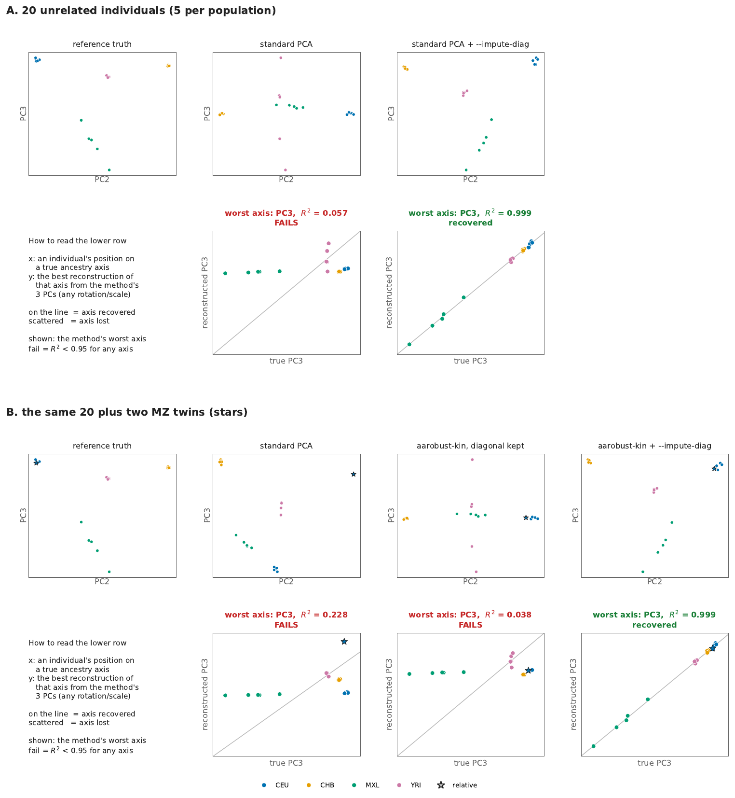

**Figure 6.** What “fail” means (the example of Figure 5). *Upper rows:* the raw PC2 and PC3 as each method returns them. *Lower rows:* for the method’s worst true axis, each individual’s true position ($x$) against the best reconstruction from the method’s three PCs ($y$, least squares on the unrelated individuals). On the line, the axis is recovered; a run fails when $R^2<0.95$ for any of the three true axes.

The same holds across the benchmark (Table 7).

- **Without diagonal imputation, both fail at $n=5$:** standard PCA on the unrelated individuals (mean min $R^2$ 0.022) and `aarobust-kin` with the diagonal kept (0.018).

- **With `--impute-diag`:** 0.985 without relatives and 0.989 with relatives.

- **From $n=20$ per population** the diagonal no longer matters, and only the relatedness correction is needed.

## 4 Building blocks

##### Data and notation.

- $G$: the $N\times M$ genotypes, coded $0/1/2$ (missing genotypes are not yet supported).

- $A=GG'$: the raw Gram matrix.

- $D_i=\frac1M\sum_s g_{is}(2-g_{is})$: the heterozygosity of individual $i$.

- $f_s$: the sample allele frequency of SNP $s$; $X$: the standardised genotypes, $(g_{is}-2f_s)/\sqrt{2f_s(1-f_s)}$.

- $C=XX'/M$: the GRM.

Everything the methods need comes from *one pass* over the genotypes.

##### The Chen & Storey (CS) matrix.

$$
H \;=\; A/M - \mathrm{diag}(D), \qquad
  \mathrm{E}[H] = (2\Pi)'(2\Pi)/M \text{ under HWE},
$$

where $\Pi$ holds the individual allele frequencies. $H$ is low rank *including its diagonal*: subtracting $D$ removes the binomial noise variance. Its first eigenvector is the mean component, so the structure PCs are eigenvectors $2,\dots,K$.

The GRM has no such correction. Its diagonal reflects heterozygosity, not structure, and at very small sample sizes this alone can create a spurious axis. For the GRM, the methods therefore treat the diagonal as *unobserved*.

##### Structure-adjusted kinship.

For a residual $R=H-L$ after removing a structure fit $L$, the kinship of pair $(i,j)$ is estimated as

$$
\hat\phi_{ij} = \frac{R_{ij}}{2\sqrt{v_iv_j}},
$$

where $v_i$ is the noise variance of individual $i$: $D_i$ on the CS scale, or the residual diagonal for the GRM. A pair is *related* when $\hat\phi_{ij}>\tau$ and the pair passes the KING screen.

##### KING-robust.

$$
\phi^{\mathrm{KING}}_{ij}=\frac{N^{\mathrm{het,het}}_{ij}-2N^{\mathrm{IBS0}}_{ij}}{2m_{ij}}
  +\frac12-\frac{N^{\mathrm{het}}_i+N^{\mathrm{het}}_j}{4m_{ij}},
  \qquad m_{ij}=\min(N^{\mathrm{het}}_i,N^{\mathrm{het}}_j),
$$

which is the formula of `plink2 --make-king`. PCAone computes it itself:

- dense engine: from indicator products accumulated in the single pass;

- operator engine: from bit-packed genotypes by popcount.

Predetermined pairs can be supplied with `--kinship` instead: a KING `.kin0` table, a `pcaone-ibd` file, or an $N\times N$ matrix.

##### Noise edge.

For an unrelated pair, the off-diagonal noise in $H$ has variance

$$
\sigma^2 = \frac{1}{M^2}\sum_s\left(\mathrm{E}[g_s^2]^2-(2f_s)^4\right),
  \qquad \mathrm{E}[g_s^2]=2f_s(1-f_s)+4f_s^2 .
$$

Noise eigenvalues of an $N\times N$ matrix of such entries end near $2\sigma\sqrt N$. An eigenvalue above this edge is structure; one below it cannot be told apart from noise. `detect-white` uses the edge to choose its rank.

## 5 The methods

### 5.1 `aarobust-kin` — with `--impute-diag`

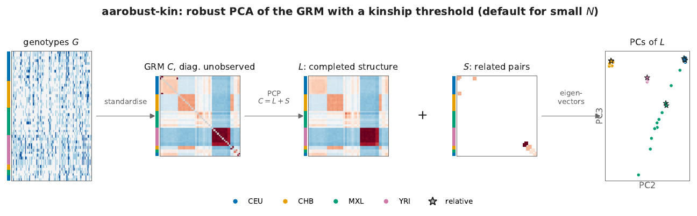

**Figure .** Graphical abstract of `aarobust-kin` on the example. Individuals are ordered by population; each relative is placed right after its closest kin. The GRM’s diagonal (grey) is treated as unobserved. PCP splits the GRM into $L$, the completed structure, and $S$, which holds the six related pairs and the diagonal. The PCs shown are those of $L$, as given with `--impute-diag`. Without it, they are the PCs of the GRM with the related entries replaced by $L$ and the observed diagonal kept.

##### Idea.

Principal component pursuit (robust PCA) of the GRM, with two changes to the standard algorithm:

1.  the diagonal is unobserved: it always goes into $S$;

2.  the $\ell_1$ soft-thresholding step that normally decides which entries go into $S$ is replaced by the kinship rule.

There is no $\lambda$ and no rank.

##### Algorithm

(inexact augmented Lagrange multiplier method).

1.  Start with $S=0$, $Y=C_{\mathrm{off}}/\max(\|C_{\mathrm{off}}\|_2,\,
        \sqrt N\max|C_{\mathrm{off}}|)$ and $\mu=1.25/\|C_{\mathrm{off}}\|_2$. Here $C_{\mathrm{off}}$ is $C$ with the diagonal set to zero.

2.  $L \leftarrow$ eigenvalue thresholding of $C-S+Y/\mu$: each eigenvalue is shrunk by $1/\mu$.

3.  Compute $B=C-L+Y/\mu$ and the noise $v=\mathrm{diag}(C-L)$. Set $S_{ij}=B_{ij}$ if pair $(i,j)$ passes the KING screen and $B_{ij}/(2\sqrt{v_iv_j})>\tau$, and $S_{ij}=0$ otherwise.

4.  The diagonal is free: $S_{ii}=(C-L)_{ii}$.

5.  $Y\leftarrow Y+\mu(C-L-S)$ and $\mu\leftarrow\min(1.5\mu,\,10^7\mu_0)$.

6.  Repeat steps 2–5 until $\|C-L-S\|_F/\|C_{\mathrm{off}}\|_F<10^{-7}$.

**Output:** the pairs in $S$ with kinship $S_{ij}/(2\sqrt{v_iv_j})$, and the top $k$ eigenvectors of

- $C-S_{\mathrm{off}}$ by default: the GRM with the related entries replaced by $L$ and the observed diagonal kept, i.e. standard PCA as if the relatives were unrelated;

- $L$ with `--impute-diag`: the diagonal imputed as well (Section 5.6).

##### Properties.

- **Does not depend on $k$.** At convergence, $L$ reproduces every entry that is not in $S$, so it is not truly low rank. The method is best read as nuclear-norm matrix completion: it fills in the diagonal and the related entries with the values most consistent with all the other entries. $k$ only selects how many PCs are written.

- **No HWE assumption in the fit.** The fit never uses the diagonal, so inbreeding and genotype errors do not affect which pairs are found. The default output keeps the observed diagonal, as standard PCA does; with `--impute-diag` the output does not use it either.

- **Cost.** Every iteration needs the full eigendecomposition, $O(N^3)$, because the thresholding needs all eigenvalues. It is therefore dense-only. This is fast for small $N$ (about 2 s at $N=500$, mostly the single pass over the genotypes) and slow beyond a few thousand individuals.

### 5.2 `detect-white` — default above $N=5000$

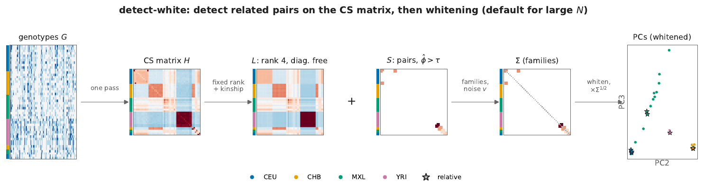

**Figure .** Graphical abstract of `detect-white`. The CS matrix and $L$ are double-centred for display only (the mean component would otherwise dominate). The noise edge chose rank 4 (three ancestry axes plus the mean). $S$ holds the detected pairs. $\Sigma$ is block diagonal: one block per family, a scalar for everyone else.

##### Idea.

Two steps.

1.  *Detection.* A low-rank fit of the CS matrix, with the related pairs removed through the kinship rule, gives the related pairs, their kinship and each individual’s noise variance.

2.  *Whitening.* The raw Gram matrix is whitened with the covariance implied by the families. The relatives then count as the “effective number” of independent individuals they represent.

##### Algorithm.

1.  *Detection fit* (AltProj style; the rank is raised one step at a time, starting at $r=1$). At rank $r$, alternate until $L$ stops changing:

    - $L$ = the rank-$r$ eigen-fit of $H-S$;

    - $R=H-L$;

    - $S_{ij}=R_{ij}$ for screened pairs with $R_{ij}/(2\sqrt{D_iD_j})>\tau$;

    - $S_{ii}=R_{ii}$ (the diagonal is free).

2.  *Rank.* Move to $r+1$ while the next eigenvalue of $H-S$ lies above the noise edge and $r<k+1$. With `--robust-fixed-rank` the rank is always $k+1$.

3.  *Pairs:* $\hat\phi_{ij}=(H-L)_{ij}/(2\sqrt{D_iD_j})$ for the pairs in $S$.

4.  *Noise:* $v_i=A_{ii}/M-L_{ii}$, the observed diagonal minus its structure part.

5.  *Whitening.* Build $\Sigma=v^{1/2}(I+2\Psi)v^{1/2}$, where $\Psi_{ij}=\hat\phi_{ij}$ for the detected pairs. $\Sigma$ is block diagonal over families, and its eigenvalues are floored at $0.1\min_iv_i$.

6.  *PCs.* Take the eigenvectors of $\Sigma^{-1/2}(A/M)\Sigma^{-1/2}$, drop the first (the mean component), keep the next $k$, and map them back by $\Sigma^{1/2}$.

##### Properties.

- **Free diagonal.** The fit never trusts $D$ on the diagonal. Inbreeding and genotype errors break the HWE-based correction (see `cswhite`) but not this method. $D$ only scales off-diagonal entries to the kinship scale.

- **Rank from the data, capped at $k+1$.** A too large $k$ is harmless.

  - With a fixed rank $k+1$ and $k=10$ (true $K=4$), mean min $R^2$ dropped from 0.996 to 0.910, and 24% of runs failed.

  - With the noise edge it stays at 0.995, with 0% failures.

  - The cap protects against overshooting when $k$ is right: unremoved first cousins can push an extra eigenvalue above the edge.

- **Scales to large $N$.** Every step works with a few vectors at a time, so the operator engine runs it matrix-free (Section 7).

### 5.3 `dwg`: `detect-white` on the GRM scale

`detect-white` works on the CS matrix, and uses heterozygosity $D$ to scale kinship. This subsection describes a version that works on the GRM scale and uses no heterozygosity at all, `dwg` (`--robust` `dwg`), the default of `--robust`. It is implemented in both engines. The dense engine reproduces the Python prototype (`scripts/relatepca/dwg_loc.py`) exactly: identical related pairs and $|\cos|=1.000000$ for the top PCs in 216 runs (8 scenarios, $n=5$–20, $k=3$ and 10, in-core and out-of-core). The operator engine gives the same related pairs as the dense engine in all 108 runs and at $N=2000$ and 5000 ($|\cos|\ge0.99999$; the two exceptions are a degenerate first-cousin case at $n=5$, $k=10$, where every method fails). Without $N\times N$ matrices it needs: exact GRM-scale entries of the candidate pairs from one weighted pass (popcounts cannot weight SNPs); the kinship among an axis’s top individuals from one product with their unit vectors; and, for the evalAdmix screen, the nearest neighbours in the count sketch with the structure axes projected out (pairs with residual correlation $>0.12$), checked with the exact evalAdmix kinship and $k_0$.

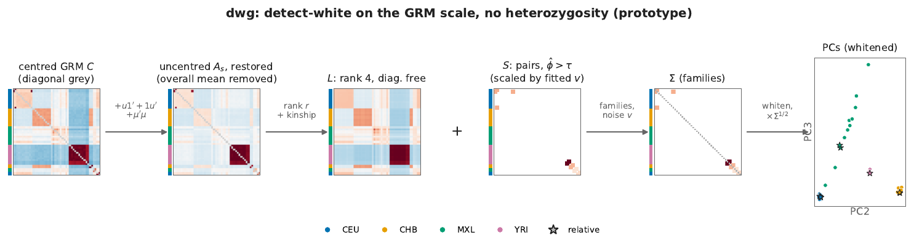

**Figure 9.** Graphical abstract of `dwg` on the example. The centred GRM (what centred data give) is turned back into the uncentred, SNP-standardised Gram $A_s$ with the allele frequencies and one number per individual ($u=X_c\mu/M$). In $C$ the YRI rows are pulled negative by their high heterozygosity, spread over the off-diagonal entries by the centring; in $A_s$ this sits in the mean component instead. The fit chooses rank 4 (three ancestry axes plus the mean) and finds the six related pairs, with kinship scaled by the fitted noise $v$ rather than heterozygosity. Whitening with the family covariance $\Sigma$ gives the PCs. Candidates come from KING and, for relatives KING misses, from an evalAdmix screen confirmed by $k_0$ (not shown). Matrices shown without the diagonal (grey) and, for $A_s$, with the overall mean removed; $L$ is double-centred for display only.

##### Why the plain GRM fails: centring.

A fixed-rank fit of the standardised GRM with the related pairs and the diagonal imputed (the original AArobust idea, with IRAM-friendly partial eigensolves) failed in 82% of runs at $n=5$ per population, even without relatives (Table 3). The cause is centring, not scaling. With $X_c=JG$ and $J=I-\mathbf{1}\mathbf{1}'/N$, the centred Gram is $C=JAJ$, and a diagonal noise term $D$ becomes

$$
JDJ \;=\; D-\frac{d\mathbf 1'+\mathbf 1d'}{N}+\frac{\bar d}{N}\mathbf 1\mathbf 1' ,
$$

so every off-diagonal entry $C_{ij}$ picks up $-(d_i+d_j)/N$. Each individual’s heterozygosity is spread over all its off-diagonal entries. In $C$ every row sums to zero, so the diagonal is determined by the off-diagonal entries ($C_{ii}=-\sum_{j\ne i}C_{ij}$): freeing the diagonal frees nothing. Heterozygosity differs by population, so the leaked rank-2 pattern lines up with the ancestry axes, and at small $N$ a fixed-rank fit takes part of it for structure. PCP survives on $C$ only because its $L$ ends up full rank.

##### Undoing the centring.

With $\mu=2f$ (scaled like the SNPs), $G=X_c+\mathbf 1\mu'$ and

$$
A \;=\; GG'/M \;=\; C+u\mathbf 1'+\mathbf 1u'+(\mu'\mu/M)\,\mathbf 1\mathbf 1',
  \qquad u=X_c\mu/M .
$$

Restoring the uncentred Gram needs $f$ and the cross term $u$, one number per individual; $C$ alone is not enough, because centring discards each individual’s component along $\mathbf 1$. The restoration is exact ($10^{-14}$). SNP scaling makes no difference: the scaled but uncentred Gram behaves exactly like the CS matrix (Table 3).

| fixed rank + kinship rule, diagonal free, on            | failures at $n=5$ / 10 / 20 |     |     |
|:--------------------------------------------------------|:---------------------------:|:---:|:---:|
| GRM, scaled and **centred** (rank $k$)                  |             82%             | 18% | 0%  |
| GRM, scaled, **not centred** (rank $k+1$, mean dropped) |             0%              | 0%  | 0%  |
| CS matrix (raw, not centred; `frkin`)                   |             0%              | 0%  | 0%  |
| PCP on the centred GRM (`aarobust-kin`)                 |            2.5%             | 0%  | 0%  |

**Table 3.** Centring, not scaling, breaks the fixed-rank fit at small $N$ (8 scenarios $\times$ 5 replicates per $n$, $k=3$, reference truth).

##### The method.

1.  *Matrix.* The uncentred, SNP-standardised Gram $A_s=GW^{-1}G'/M$ with $W=\mathrm{diag}(2f(1-f))$, restored as above if the data arrive centred. No heterozygosity is subtracted.

2.  *Detection*, as in `detect-white`: rank raised from 1; at each rank, alternate $L=$ rank-$r$ eigen-fit of $A_s-S$, $R=A_s-L$, $S_{ij}=R_{ij}$ for candidate pairs (KING, then the screen below) with $\hat\phi_{ij}=R_{ij}/(2\sqrt{v_iv_j})>\tau$, and $S_{ii}=R_{ii}$ (free diagonal). The kinship is scaled by the *fitted* noise $v_i=A_{s,ii}-L_{ii}$, as in `aarobust-kin`, not by heterozygosity.

3.  *Rank* from the noise edge on the GRM scale, $2\sigma\sqrt N$ with $\sigma^2=\sum_s\big(E[g^2]^2-(2f_s)^4\big)/(2f_s(1-f_s))^2/M^2$, at most $k+1$ (the extra one is the mean component); localised family axes do not count (see the candidate screen).

4.  *Whitening*: $\Sigma=v^{1/2}(I+2\Psi)v^{1/2}$; the PCs are eigenvectors $2..k+1$ of $\Sigma^{-1/2}A_s\Sigma^{-1/2}$, mapped back by $\Sigma^{1/2}$.

##### Why whitening, not the PCs of $L$ or of the imputed GRM.

- $L$ has rank $r$ (about 4 here), so it defines only $r-1$ PCs; asking for $k=10$ gives 7 arbitrary vectors.

- The GRM with the related-pair entries and the diagonal imputed from $L$ has full rank and is as accurate on the top PCs. But imputation leaves each relative counted as a full individual (siblings keep near-identical correlations with everyone else). Beyond the ancestry axes, family influence stayed about twice as large as with whitening (median $\eta^2$ 0.37 against 0.21 at $N=2000$, 30% in families). The diagonal must be imputed: keeping the observed one fails in 100% of runs at $n=5$, and the CS-corrected one in 12.5%.

|                                  |                        |                        |                  |                               |
|:---------------------------------|:----------------------:|:----------------------:|:----------------:|:-----------------------------:|
|                                  |    failures, $k=3$     |    failures, $k=10$    | relatives’ error | family axes / median $\eta^2$ |
|                                  | ($n=5$ / 10 / 20 / 40) | ($n=5$ / 10 / 20 / 40) |   ($k=3$ / 10)   |     ($N=2000$, 30% / 10%)     |
| `aarobust-kin`                   |    2.5% / 0 / 0 / 0    |    2.5% / 0 / 0 / 0    |   0.06 / 0.06    |               –               |
| `detect-white` (CS)              |     0 / 0 / 0 / 0      |     0 / 0 / 0 / 0      |   0.05 / 0.11    |      0 / 0.21; 0 / 0.07       |
| `dwg`, kinship scaled by $D$     |     0 / 0 / 0 / 0      |    2.5% / 0 / 0 / 0    |   0.06 / 0.11    |      0 / 0.21; 0 / 0.07       |
| **`dwg`, kinship scaled by $v$** |     0 / 0 / 0 / 0      |    2.5% / 0 / 0 / 0    |   0.06 / 0.11    |      0 / 0.21; 0 / 0.07       |
| standard PCA                     |  100% / 78% / 60% / 0  |          same          |       0.67       |     16 / 0.92; 16 / 0.86      |

**Table 4.** `dwg` against the current methods. Small $N$: 8 scenarios (including an inbred population and genotype errors) $\times$ 5 replicates per $n$, reference truth; mean min $R^2$ was 0.991–0.993 at $n=5$ and 0.997–0.999 above for all four robust methods. Large $N$: the 16 PCs beyond the 4 ancestry axes at $k=20$. The one failure of `dwg` at $k=10$ (first cousins, $n=5$) is a borderline case shared by all three noise-edge methods: the cousins push one extra eigenvalue above the edge (rank 5), and `detect-white` lands at min $R^2=0.953$, just above the line.

##### The candidate screen: beyond KING.

KING-robust misses relatives of different ancestry (Table 5). Such a pair can never enter $S$: it stays in the structure fit, and with a large $k$ it creates a family axis that the noise edge accepts as structure. `dwg` therefore adds three rules.

1.  *evalAdmix screen.* After a first fit with the KING screen, the evalAdmix kinship (correlation of residuals given the structure axes, admixture-aware) is computed for all pairs, and pairs above 0.04 become candidates; the fit is repeated until the pairs are stable. The axes must be the structure axes only: with all $k=10$ PCs the family axes absorb the relatives, and from an unscreened fit the axes are wrong at small $N$ (20% failures at $n=5$).

2.  *Family axes.* An eigenvector above the noise edge that rests on fewer than 4 individuals ($n_{\mathrm{eff}}=1/\sum_iu_i^4<4$) and has a related pair among its top individuals (structure-adjusted kinship $>2^{-4.5}$) is a family, not structure: the rank is not raised, the pairs among its top individuals become candidates, and the fit is repeated. If nothing new can be added (e.g. first cousins, below $\tau$), the rank stops there. Family axes are also left out of the evalAdmix screen. This replaces knowing $K$: ancestry axes rest on whole populations ($n_{\mathrm{eff}}$ 14–49 at $n=20$), family axes on 2–3 individuals.

3.  *IBD confirmation.* evalAdmix itself flags unrelated admixed individuals of similar ancestry at small $N$ (two MXL individuals: 0.113, above true 2nd-degree pairs). A candidate found only by evalAdmix is kept only if it looks IBD-related: $k_0=$ observed / expected opposite homozygotes $<0.8$, with individual allele frequencies from the structure axes (pair left out). Unrelated pairs have $k_0\approx1$ whatever their admixture; 2nd-degree relatives about 0.5.

| true close pair (pedigree kinship)                  | lowest KING | lowest evalAdmix |
|:----------------------------------------------------|:-----------:|:----------------:|
| grandparent YRI – grandchild $\tfrac14$ YRI (0.125) |  $-0.013$   |      0.085       |
| aunt CHB – nephew half CHB/YRI (0.125)              |    0.017    |      0.089       |
| half-sibs CEU$\times$CHB / CEU$\times$YRI (0.125)   |    0.069    |      0.089       |
| parent – child CEU$\times$YRI (0.25)                |    0.187    |      0.236       |

**Table 5.** KING-robust for relatives of different ancestry (5 replicates per $n$); the screen is 0.04. evalAdmix from the structure axes of the fit.

|                                            |                        |                        |                                |                  |
|:-------------------------------------------|:----------------------:|:----------------------:|:------------------------------:|:----------------:|
| screen                                     |    failures, $k=3$     |    failures, $k=10$    |      recall of true pairs      | relatives’ error |
|                                            | ($n=5$ / 10 / 20 / 40) | ($n=5$ / 10 / 20 / 40) | ($k=10$; $n=5$ / 10 / 20 / 40) |     ($k=10$)     |
| KING only                                  |     0 / 0 / 0 / 0      |  6.7% / 6.7% / 0 / 0   |     88% / 88% / 86% / 90%      |       0.25       |
| evalAdmix, true $K-1$ axes                 |     0 / 0 / 0 / 0      |    6.7% / 0 / 0 / 0    |     90% / 96% / 97% / 100%     |       0.21       |
| **`dwg`: family axes + evalAdmix + $k_0$** |   **0 / 0 / 0 / 0**    |  **1.7% / 0 / 0 / 0**  |   **95% / 96% / 97% / 100%**   |     **0.09**     |

**Table 6.** The candidate screen without knowing $K$ (12 scenarios including the cross-ancestry ones, 5 replicates; no false pairs). With $k=3$ the recall of `dwg` is the same as with $k=10$; only 2 of 240 runs change by more than 0.01 in min $R^2$ between $k=3$ and $k=10$ (12 with the KING screen alone). The one failure (first cousins, $n=5$) is shared by every method, including the true-$K$ screen.

##### What `dwg` brings.

The same accuracy as `detect-white` at small and large $N$, with all $k$ PCs and no family axes, but

- no HWE assumption within individuals: kinship is scaled by the fitted noise, so an inbred individual’s kinship is no longer overestimated (the noise edge still uses population allele frequencies);

- relatives of different ancestry are found (recall 86–90% $\to$ 95–100%);

- $k$ is only an upper bound: family axes no longer raise the rank;

- PCs and eigenvalues on the scale of standard PCAone.

##### Speed.

`dwg` is the `detect-white` algorithm with a different scaling, plus one evalAdmix computation and a refit only when the screen adds candidates. With the same Python prototypes and full eigendecompositions in all three: $N=2000$ took 29 s (`dwg`), 27 s (`detect-white`) and 24 s (`aarobust-kin`). The difference in PCAone comes from the eigensolver each method can use: `detect-white` needs only the top $r$ eigenvectors per step (warm-started subspace iteration, and the operator engine at large $N$), whereas PCP needs the full spectrum (Section 5.3).

| PCAone, dense engine, 16 threads         | $N=500$ | $N=1000$ | $N=2000$ |
|:-----------------------------------------|:-------:|:--------:|:--------:|
| `detect-white`                           |  1.5 s  |  4.0 s   |  9.0 s   |
| `dwg`, dense engine                      |  1.8 s  |  4.5 s   |  10.7 s  |
| `dwg`, operator engine (default in-core) |  0.7 s  |  1.1 s   |  1.8 s   |
| `aarobust-kin` `--impute-diag`           |  4.7 s  |  30.7 s  |  248 s   |

In the operator engine, one detail differs: the candidate pairs’ Gram entries come from bit-packed popcounts, which cannot apply per-SNP weights, so on the GRM scale they need one weighted pass.

##### IRAM for PCP itself.

Computing only the eigenpairs above PCP’s threshold (Spectra, as `--svd` 0) gives identical results but no speed-up: once the threshold $1/\mu$ falls below the noise edge, $L$ absorbs the noise (rank 5 $\to$ 1995 at $N=2000$) only to make $M=L+S$ exact, and the partial solves fall back to full ones. Stopping at the noise edge (soft-impute) is 10$\times$ faster at $N=2000$ with the same pairs, but at small $N$ it misses relatives (min $R^2$ 0.76 at $n=5$): with a low threshold from the start, $L$ absorbs a family before its entries reach $S$. PCP works because it starts with a high threshold.

### 5.4 `cswhite`

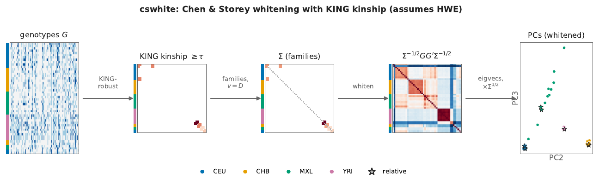

**Figure .** Graphical abstract of `cswhite`. The pairs and their kinship come straight from KING-robust (or `--kinship`). $\Sigma$ uses heterozygosity $D$ as the noise variance. The whitened Gram matrix is shown with its mean removed.

##### Idea and algorithm.

The whitening step of `detect-white` without the detection fit:

- the pairs are those with KING-robust kinship $\ge\tau$ (or from `--kinship`), with $\Psi_{ij}=\phi^{\mathrm{KING}}_{ij}$;

- the noise variance is $v=D$;

- the PCs are eigenvectors $2..K$ of $\Sigma^{-1/2}(A/M)\Sigma^{-1/2}$, mapped back by $\Sigma^{1/2}$.

##### Properties.

- **Cost.** The cheapest mode: no iterative fit, and it is a row transformation of the genotypes.

- **Assumes HWE within individuals.** With inbred individuals (children of relatives, or a population with elevated $F$) or genotype errors, $D$ misstates their noise variance and the PCs are distorted. PCAone prints a warning.

### 5.5 `frkin`

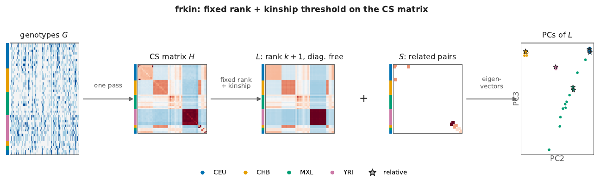

**Figure .** Graphical abstract of `frkin`: the detection fit of `detect-white` at fixed rank $k+1$; the PCs are taken from $L$.

##### Idea and properties.

The detection fit of `detect-white` (diagonal free, KING screen) at the fixed rank $k+1$. The PCs are eigenvectors $2,\dots,k+1$ of $L$, with no whitening. It performed as well as `detect-white` at the correct $k$. It is sensitive to a too large $k$ (mean min $R^2$ 0.967 at $k=10$), because its PCs come directly from the rank-$(k+1)$ fit.

### 5.6 The diagonal: `--impute-diag`

##### Why.

The GRM diagonal mostly reflects each individual’s heterozygosity, not ancestry. With few individuals per population, this uneven diagonal is enough to create a spurious axis, with or without relatives. `--impute-diag` replaces the diagonal by values imputed from the off-diagonal entries: PCP with the diagonal unobserved, as in `aarobust-kin` (in the spirit of HeteroPCA). It is a separate switch because it fixes a different problem from the relatedness correction:

- alone: standard PCA with the diagonal imputed (no related pairs considered);

- with `--robust` `aarobust-kin`: the PCs come from $L$ instead of from $C-S_{\mathrm{off}}$;

- the CS-based modes (`detect-white`, `cswhite`, `frkin`) correct the diagonal already and reject the switch.

@lcccc@ & $n=5$ & $n=10$ & $n=20$ & $n=40$  
  
standard PCA, everyone & 0.128 & 0.390 & 0.736 & 0.992  
standard PCA, unrelated individuals only & 0.022 & 0.973 & 0.996 & 0.998  
`aarobust-kin` (diagonal kept) & 0.018 & 0.980 & 0.996 & 0.998  
`aarobust-kin` `--impute-diag` & **0.989** & **0.997** & 0.998 & 0.999  
  
`aarobust-kin` (diagonal kept) & **0.994** & **0.9996** & 0.9999 & 1.0000  
`aarobust-kin` `--impute-diag` & 0.002 & 0.993 & 0.998 & 0.9995  
  
standard PCA & 0.021 & 0.970 & 0.996 & 0.998  
`--impute-diag` & **0.985** & **0.997** & 0.998 & 0.999  

**Table 7.** The diagonal kept or imputed (admixTjeck2, 54k SNPs). Keeping the diagonal reproduces standard PCA of the unrelated individuals: it removes the relatives’ effect, but at $n=5$ that PCA itself misses an axis. Imputing the diagonal recovers the true axes, with or without relatives. From $n=20$ per population the two agree.

##### Two targets.

- *“Standard PCA as if the relatives were unrelated”:* `aarobust-kin` with the diagonal kept, the default.

- *“The true ancestry axes”:* add `--impute-diag`. This is recommended with fewer than about 20 individuals per population.

`--impute-diag` alone does *not* correct for relatives (with an MZ pair at $n=5$ or 10, min $R^2$ 0.09–0.18). The eigenvalues then measure structure variance only, without the per-individual noise. The switch needs the dense engine: a full eigendecomposition per iteration, so it suits $N$ up to about 1–2 thousand.

## 6 Final relatedness of the related pairs

Each method uses a kinship to decide *which* pairs are related and how much they are down-weighted: the detection kinship $\hat\phi$ (`detect-white`, `frkin`, `aarobust-kin`) or KING (`cswhite`). This kinship is good enough to decide that, but it is not the best estimate to report:

- it rests on the structure fit, not on the final PCs;

- it gives $\phi$ only, and kinship alone cannot tell a parent–offspring pair from full sibs (both have $\phi=1/4$).

After the final PCs, one more pass over the genotypes therefore estimates the relatedness of every detected pair from *individual allele frequencies* (IAF) implied by the PCs.

1.  **IAF.** With $V=[\mathrm{PC}_1..\mathrm{PC}_k,\mathbf 1]$, $\pi_{is}=\tfrac12\,[V(V'V)^{-1}V'g_s]_i$, clipped to $[0.001,0.999]$.

2.  **Leave the family out.** For a pair, the regression that gives $\pi$ leaves out *all* members of the pair’s family (everyone connected to it through related pairs; families of more than 100 fall back to leaving out the pair). Otherwise, at small $N$, the other members absorb part of the signal shared within the family. With four sibs among about 15 individuals of a population, leaving out only the pair gave $k_0\approx0.32$ for the sibs instead of 0.25.

3.  **IBD sharing** $(k_0,k_1,k_2)$ by maximum likelihood, with the allele-level likelihood of `pcaone-ibd`. It keeps $\pi_i$ and $\pi_j$ apart, which is essential for relatives of different ancestry.

    - The log-likelihood $\sum_s\log(k\cdot\ell_s)$ is concave on the simplex. A projected Newton method with an active set converges in a few passes over the sites, also on the boundary (parent–offspring: $k_0=0$; MZ: $k_0=k_1=0$), where plain EM needs hundreds of iterations.

    - On 538 pairs it reached the maximum likelihood from both a uniform and a moment-based start, and it matched or beat 20,000 EM iterations.

4.  **Kinship** $\phi=k_1/4+k_2/2$ from the same fit.

5.  **evalAdmix kinship**, for comparison: half the correlation of residuals of `--evaladmix` (projection estimator), computed for these pairs only. It equals the `--evaladmix` matrix entries exactly.

| data        | relationship           | $n$ |           KING            | detection $\hat\phi$ | **final $\phi$** |      $k_0$       |      $k_1$      |      $k_2$      |
|:------------|:-----------------------|:---:|:-------------------------:|:--------------------:|:----------------:|:----------------:|:---------------:|:---------------:|
| simulated   | MZ                     |  5  |           0.500           |        0.499         |      0.500       |      0.000       |      0.000      |      1.000      |
| $N=2000$    | parent–offspring       | 306 |           0.249           |        0.250         |      0.251       |      0.000       |      0.996      |      0.004      |
|             | full sibs              | 143 |           0.249           |        0.250         |      0.250       |      0.250       |      0.500      |      0.250      |
|             | 2nd degree             | 84  |           0.122           |        0.125         |      0.126       |      0.504       |      0.490      |      0.006      |
| admixTjeck2 | full sibs              |  8  |           0.253           |        0.246         |      0.257       |      0.238       |      0.496      |      0.266      |
| $N=47$      | parent–offspring       |  4  |           0.250           |        0.247         |      0.253       |      0.000       |      0.989      |      0.011      |
|             | half sibs              |  3  |           0.125           |        0.125         |      0.145       |      0.435       |      0.551      |      0.014      |
|             | avuncular, grandparent |  2  |           0.132           |        0.125         |      0.145       |      0.442       |      0.539      |      0.020      |
| expected    | MZ / PO / FS / 2nd     |     | 0.5 / 0.25 / 0.25 / 0.125 |                      |                  | 0 / 0 / .25 / .5 | 0 / 1 / .5 / .5 | 1 / 0 / .25 / 0 |

**Table 8.** Final relatedness (means), from the `.relpairs` output. In the simulation (unlinked SNPs, 30% in families, `detect-white`, $k=4$), the relationship types are fully separated by $k_0$ (sd 0.011 for full sibs). In the small real-data-based set (`aarobust-kin` `--impute-diag`, $k=2$; relatives made from real genotypes with recombination, so the realised relatedness varies around the pedigree value), parent–offspring and full sibs are again separated. The 2nd-degree kinship is about 0.02 too high there, with a small spurious $k_2$. The evalAdmix kinship of the same pairs is biased the other way at this $N$: on average 0.22 for the 1st-degree pairs, because it has no leave-out.

## 7 Engines

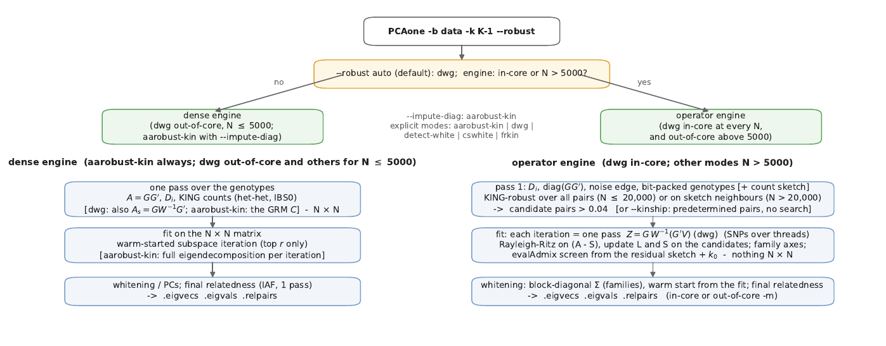

**Figure .** Mode selection (`--robust` `auto`) and the two engines.

##### Dense engine.

This is used for `aarobust-kin` always, and for the other modes when $N\le5000$ (`--robust-dense-max`).

- **One pass.** A single streaming pass (in-core or out-of-core with `--memory`) accumulates $A$, $D$, the KING counts and, for `aarobust-kin`, the GRM $C$. Everything else works on $N\times N$ matrices in memory.

- **Partial eigen-solves.** The fits of `detect-white` and `frkin` only need the top $r\le k+1$ eigenvectors. They come from subspace iteration warm-started from the previous iteration, $O(N^2k)$ per iteration instead of $O(N^3)$. At $N=5000$ this took the fit from 70 min to 35 s with identical results.

##### Operator engine.

This is used for $N>5000$, or with `--robust-engine` `operator`. No $N\times N$ matrix is formed.

1.  *Pass 1.* Compute $D$, the diagonal of $A$ and the noise edge, and store the genotypes as three bit masks per individual (heterozygous, hom 0, hom 2): $3NM/8$ bytes.

2.  *Candidate pairs.* Up to $N=20{,}000$: KING over all pairs, popcounts in tiles of 128 individuals over all threads, keeping only the pairs above 0.04. Above that: the sketch search of Section 7.1 (`--king-search`). The Gram entries of the candidate pairs also come from popcounts. With `--kinship`, the supplied pairs are used and no search is done.

3.  *Fit.* Each iteration is *one pass* over the genotypes, $Z=G(G'V)$ for a block of $k+6$ vectors, with the SNPs split over threads. It is followed by a Rayleigh–Ritz step on $H-S$ and an update of $L$ and $S$ on the diagonal and the candidate entries.

4.  *Whitening.* The block-diagonal $\Sigma$ is applied family by family. The iteration is warm-started from the fit’s eigenvectors multiplied by $\Sigma^{-1/2}$.

5.  *Convergence* (`--robust-tol`, default $10^{-6}$): the structure eigenpairs must reach the tolerance. The remaining output PCs lie in the flat noise spectrum, and once the structure has converged they get at most 10 more passes.

In-core and out-of-core give the same results. Out-of-core re-reads the file in every pass, so it is slower.

##### Final PCs by winSVD.

With `--robust-pcs` `winsvd`, the final PCs of the whitening modes come from PCAone’s window-based randomized SVD (`--svd` 2) instead of the operator iteration. It runs on the whitened raw genotypes $\Sigma^{-1/2}G$, with $\Sigma^{-1/2}$ applied to every block as it is read (or once in place in-core). It computes $k+1$ components, drops the first and maps back by $\Sigma^{1/2}$. The PCs are the same ($|\cos|\ge0.99999$ at $N=20{,}000$), but it is not faster: the operator iteration is warm-started and needs only a few passes, while most of the passes go to the detection fit (about 20 of 26). The default therefore stays `operator`.

### 7.1 Very large $N$: finding the relatives with a sketch

KING over all pairs costs $N^2M/64$ popcounts: 6.5 s at $N=20{,}000$ and 162 s at $N=100{,}000$ ($M=20{,}000$), and it grows with $M$. Above `--king-sketch-min` (20,000) it is replaced by a nearest-neighbour search.

1.  **Count sketch, in the first pass.** Each SNP $j$ is standardised and added, with a random sign $\sigma(j)$, to one of $s$ columns $h(j)$ of $Y$ ($N\times s$, $s=2048$, `--king-sketch-dim`). $h$ and $\sigma$ come from a hash of the SNP index, so nothing is stored and in-core and out-of-core give the same sketch. The cost is $N\times M$, like one more vector in the pass.

2.  **Nearest neighbours.** After normalising its rows, the correlation of two rows of $Y$ estimates the genotype correlation of the pair: about $2\phi$ for relatives and $0\pm1/\sqrt s$ for unrelated pairs (Figure 4). The $m=5$ most correlated individuals of every individual (`--king-neighbours`) are found with blocked float matrix products: cost $N^2s$, independent of $M$.

3.  **Adaptive $m$.** If all $m$ neighbours of an individual turn out to be relatives (a large family), its search is extended to $2m$, $4m$, … until one is not.

4.  **KING on the candidates.** Exact KING-robust for the about $3.5N$ candidate pairs; those above 0.04 become the candidates of the fit.

No population-structure correction is needed: removing the top PCs from the sketch made no difference, also with strong structure ($F_{ST}$ up to 0.15). Two cheaper variants failed in the prototype (`relfind_bits.py`):

- 1-bit signs lose too much (2nd-degree recall 94% at the same $s$);

- bucketing (LSH) cannot work, because a 2nd-degree pair agrees on only 53–59% of the sign bits, against 50% for unrelated pairs.

## 8 Usage and output

      PCAone -b data -k 3 --robust                    # auto: dwg
      PCAone -b data -k 3 --robust --impute-diag      # aarobust-kin, diagonal imputed
      PCAone -b data -k 3 --impute-diag               # unrelated samples, small N
      PCAone -b data -k 3 --robust detect-white       # a specific mode
      PCAone -b data -k 3 --robust --kinship pairs.kin0  # known family pairs
      PCAone -b data -k 10 --robust detect-white -m 2  # out-of-core, 2 GB
      PCAone -b data -k 4 --robust --king-search sketch  # sketch, any N

| option                | default    | meaning                                                                 |
|:----------------------|:-----------|:------------------------------------------------------------------------|
| `--robust` \[mode\]   | `auto`     | `auto`, `aarobust-kin`, `detect-white`, `cswhite`, `frkin`, `dwg`       |
| `-k`                  |            | number of PCs written ($K-1$); upper bound for the `detect-white` rank  |
| `--kin-min`           | $2^{-3.5}$ | kinship threshold $\tau$                                                |
| `--king-screen`       | 0.04       | only pairs with KING-robust kinship above this can be related           |
| `--kinship` \[file\]  |            | predetermined pairs (KING `.kin0`, `pcaone-ibd`, or $N\times N$ matrix) |
| `--impute-diag`       | off        | impute the GRM diagonal (standard PCA or `aarobust-kin`)                |
| `--robust-fixed-rank` | off        | `detect-white`: rank $k+1$ instead of the noise edge                    |
| `--robust-small-max`  | 1000       | `auto` `--impute-diag`: largest $N$ for `aarobust-kin`                  |
| `--robust-engine`     | `auto`     | `dense`, `operator`, `auto`                                             |
| `--robust-dense-max`  | 5000       | `auto` engine: largest $N$ for the dense engine                         |
| `--robust-tol`        | $10^{-6}$  | operator engine: convergence tolerance                                  |
| `--king-search`       | `auto`     | operator engine: `all` (KING over all pairs), `sketch`, `auto`          |
| `--king-sketch-min`   | 20,000     | `auto`: sketch search above this $N$                                    |
| `--king-sketch-dim`   | 2048       | columns of the count sketch                                             |
| `--king-neighbours`   | 5          | neighbours checked per individual (doubled for large families)          |
| `--robust-pcs`        | `operator` | final PCs of the whitening modes: `operator` or `winsvd`                |

**Table .** Options of `--robust`.

**Small-sample warning.** PCAone warns when $N/(k+1)<20$, i.e. fewer than about 20 individuals per population assuming $k+1$ populations, and `--impute-diag` is not set. This applies to standard PCA of genotypes and to `aarobust-kin` run without `--impute-diag`. The default `dwg`, `detect-white` and `frkin` keep the diagonal free, and `cswhite` corrects it, so they do not warn.

Output files:

- `.eigvecs` and `.eigvecs2`: the PCs, the latter with sample IDs as for any PCAone run;

- `.eigvals`;

- `.relpairs`: the related pairs, with columns

  - `ID1 ID2`;

  - `KING`: KING-robust;

  - `KIN_DETECT`: the kinship used by the method (it decides the pair and its weight);

  - `KINSHIP K0 K1 K2`: the final relatedness from the final PCs (Section 6);

  - `KIN_EVALADMIX`: the `--evaladmix` kinship of the pair.

In the example, the detection kinships were 0.249, 0.250, 0.484, 0.250, 0.095 and 0.133, against pedigree values 0.25, 0.25, 0.5, 0.25, 0.125 and 0.125.

## 9 Evidence so far

##### Correctness.

- The C++ implementation reproduces the Python prototypes exactly for all four modes: identical related pairs and $|\cos|=1.000000$ per PC, in-core and out-of-core. The check covers 8 scenarios (including inbreeding and genotype errors), $n=5$–40 per population, and $k=3$ and 10.

- The operator engine reproduces the dense engine, and its internal KING reproduces `plink2` (the same 2092 candidate pairs at $N=20{,}000$).

- The sketch search gives exactly the same related pairs and PCs ($|\cos|=1$) as KING over all pairs: two data sets at $N=20{,}000$ (in-core and out-of-core) and one at $N=100{,}000$.

- The final relatedness reproduces `--evaladmix` exactly (its kinship) and `pcaone-ibd` to $10^{-6}$ (its $k_0,k_1,k_2$, before the leave-family-out change).

##### Small $N$

(admixTjeck2; $n=5$, 10, 20 per population; 8 scenarios; 5 replicates; 54k SNPs).

|                                  | mean min $R^2$ ($k=3$ / $k=10$) | runs with min $R^2<0.95$ | relatives’ error |
|:---------------------------------|:-------------------------------:|:------------------------:|:----------------:|
| standard PCA                     |          0.418 / 0.418          |           79%            |       0.75       |
| `aarobust-kin` `--impute-diag`   |          0.995 / 0.995          |           0.8%           |       0.07       |
| `detect-white` (noise-edge rank) |          0.996 / 0.995          |            0%            |    0.06–0.14     |
| `detect-white`, fixed rank $k+1$ |          0.996 / 0.910          |         0% / 24%         |   0.06 / 0.32    |

**Table .** Accuracy of the top $K-1=3$ PCs against the reference truth. Earlier tests (`extensive_tests.pdf`) showed that inbreeding and genotype errors break the HWE-based diagonal correction but not the free diagonal used by `aarobust-kin` and `detect-white`.

##### Large $N$

(simulated: $N=2000$, 5000 and 20,000; 5 populations with $F_{ST}$ from 0.05 to 0.002 plus an admixed group; 10% or 30% of individuals in families; 20k SNPs; 2 replicates).

|                                              |                            | $N=2000$ | $N=5000$ | $N=20{,}000$ |
|:---------------------------------------------|:---------------------------|:--------:|:--------:|:------------:|
| top 4 PCs, min $R^2$                         | standard                   |  0.956   |  0.976   |    0.984     |
|                                              | `detect-white` / `cswhite` |  0.957   |  0.971   |    0.979     |
| relatives’ error                             | standard                   |   0.49   |   0.15   |     0.07     |
|                                              | `detect-white` / `cswhite` |   0.12   |   0.10   |     0.08     |
| family axes among the 16 extra PCs ($k=20$)  | standard                   |    16    |    16    |     9.25     |
|                                              | `detect-white` / `cswhite` |    0     |    0     |      0       |
| largest family share $\eta^2$ of an extra PC | standard                   |   0.91   |   0.83   |     0.57     |
|                                              | `detect-white` / `cswhite` |   0.17   |   0.14   |     0.13     |

**Table .** Large $N$. A family axis is an extra PC (beyond the four ancestry axes) whose variance is more than half explained by family membership ($\eta^2>0.5$).

- **Top PCs.** Relatives do not distort the top ancestry axes at these sample sizes. Standard PCA is even marginally better at large $N$.

- **Relatives’ placement and family axes.** These are the large-$N$ effects. Both fade as $N$ grows, as expected: a family stands out only while its eigenvalue exceeds the noise edge, which rises with $N/M$. `detect-white` and `cswhite` remove both at every $N$.

- **Rank.** The noise edge chose the correct rank (5) in every run.

##### Realistic LD and ancestry (HAPNEST).

Synthetic biobank genotypes with realistic LD (HAPNEST; chromosomes 12–22, LD-pruned to 68,044 SNPs; six ancestries, three of them admixed). $N=5000$ with 30% in families built by transmission with recombination, including relatives of different ancestry; truth from a disjoint reference panel of 3600 (five ancestry axes).

|                | min $R^2$ (5 axes) | relatives’ error | family axes ($k=20$) |  recall   | grandparent across ancestries | false pairs |   time   |     |
|:---------------|:------------------:|:----------------:|:--------------------:|:---------:|:-----------------------------:|:-----------:|:--------:|:---:|
| standard PCA   |       0.9987       |      0.048       |       15 of 15       |     –     |               –               |      –      |   14 s   |     |
| `detect-white` |       0.9977       |      0.028       |          0           |   97.3%   |              66%              |      0      |  100 s   |     |
| **`dwg`**      |     **0.9988**     |    **0.019**     |          0           | **98.3%** |            **87%**            |      0      | **21 s** |     |

**Table .** HAPNEST, $N=5000$ (1254 true pairs with pedigree kinship $\ge\tau$; 16 threads). The dense and operator engines of `dwg` give identical pairs and PCs. All 22 pairs `dwg` misses have realised kinship below $\tau$ (PC-adjusted 0.057–0.087): recombination makes realised relatedness of 2nd-degree pairs vary, and these are not detectable by design. Final $(k_0,k_1,k_2)$: parent–offspring (0.00, 1.00, 0.00), full sibs (0.25, 0.50, 0.26), 2nd degree (0.50, 0.50, 0.00), MZ (0, 0, 1).

##### A second real panel (1000 Genomes with ASW).

CEU, CHB, YRI and the admixed ASW (366 individuals, 100k complete SNPs); relatives made from real genotypes with recombination, including ASW families and relatives of different ancestry; $n=5$–20 per population, 3 replicates, 10 scenarios.

|                | failures ($n=5$ / 10 / 20) | recall ($n=5$ / 10 / 20) | grandparent across ancestries | relatives’ error ($k=2$ / 10) |
|:---------------|:--------------------------:|:------------------------:|:-----------------------------:|:-----------------------------:|
| standard PCA   |       27% / 10% / 0        |            –             |               –               |             0.23              |
| `aarobust-kin` |         0 / 0 / 0          |     84% / 78% / 80%      |              44%              |         0.045 / 0.045         |
| `detect-white` |         0 / 0 / 0          |     83% / 78% / 78%      |              44%              |          0.03 / 0.07          |
| **`dwg`**      |         0 / 0 / 0          |   **90% / 95% / 96%**    |           **100%**            |         0.036 / 0.041         |

**Table .** 1000 Genomes panel. The pairs reported beyond the simulated pedigree are real relatives in the panel (e.g. NA20317/NA20318, kinship 0.25), found by every robust method.

##### Very large $N$: finding the relatives

(simulated as above, 30% in families, 20k SNPs; truth: `plink2` KING over all pairs).

|                                       | candidates per person |   MZ    |  1st degree   | 2nd degree | 3rd degree |
|:--------------------------------------|:---------------------:|:-------:|:-------------:|:----------:|:----------:|
| $N=20{,}000$, sketch $s=2048$, $m=5$  |          3.5          |  100%   |     100%      |    100%    |   98.8%    |
| strong structure ($F_{ST}\le0.15$)    |          3.8          |  100%   |     100%      |    100%    |   98.7%    |
| $s=1024$                              |          3.5          |  100%   |     100%      |    100%    |    79%     |
| -bit signs, 2048 bits                 |          3.4          |  100%   |     100%      |    100%    |    66%     |
| $N=100{,}000$, sketch $s=2048$, $m=5$ |          3.6          | 520/520 | 23,300/23,300 | 4060/4060  |     –      |

**Table .** Recall of the true pairs among the checked candidates. 3rd-degree pairs lie below the threshold $\tau$ and do not affect the PCs.

| $N=100{,}000$, 16 threads, in-core  | finding the relatives | final relatedness | total |
|:------------------------------------|:---------------------:|:-----------------:|:-----:|
| `detect-white`, KING over all pairs |         162 s         |       20 s        | 232 s |
| `detect-white`, sketch search       |         52 s          |       20 s        | 118 s |
| standard PCAone (`--svd` 2)         |           –           |         –         | 148 s |

**Table .** Run time at $N=100{,}000$. Both robust runs give identical related pairs (27,880) and PCs. The first pass takes 11 s and the 22 genotype products 17–20 s.

##### Speed

(16 threads, in-core, everything included).

- **Small $N$ (dense):**

  - $N=48$: about 0.2 s for either default;

  - $N=500$: 7.5 s for `aarobust-kin`;

  - $N=1000$: 33 s for `aarobust-kin`, against 4 s for `detect-white`.

- **Large $N$ (operator):**

  - $N=5000$: 3.8 s, against 5.0 s for standard PCAone;

  - $N=20{,}000$: 21 s including the internal KING, against 24 s for standard PCAone;

  - $N=20{,}000$ with $k=10$ or 20: 26–30 s.

- **Very large $N$ (operator + sketch):** $N=100{,}000$: 118 s including the final relatedness, against 148 s for standard PCAone.

## 10 Limitations and next steps

- **Missing genotypes** are not supported yet: `--robust` stops if any genotype is missing. This is needed for real large data.

- **Out-of-core** runs need about 25–30 passes over the file: 135 s at $N=20{,}000$, against 20 s in-core, and 29 s for standard PCAone out-of-core. Most passes go to the detection fit. Moving the final PCs to winSVD does not help (Section 7); fewer detection passes (block Krylov, or a sketch of $GG'$ from the first pass) would.

- **The sketch search** is still quadratic in $N$ ($N^2s$): about 20 min at $N=500{,}000$ and 1.5 h at $N=10^6$ on 16 threads (extrapolated). The bit-packed genotypes ($3NM/8$ bytes) are kept in memory for the KING check.

- **Linkage.** Checked at $N=5000$ on HAPNEST (realistic LD, relatives with recombination); the $N=100{,}000$ tests still use unlinked SNPs.

- **Genotype likelihoods** are not supported (genotype calls only).

- **Final relatedness at small $N$**: 2nd-degree kinship about 0.02 too high in the $N=47$ real-data set (Table 8).

- **The rank choice** could be offered to the rest of PCAone.

- **`dwg` at very large $N$** needs a second sketch neighbour search for the evalAdmix screen (about 50 s at $N=100{,}000$). One search on the residual sketch could serve both screens.
